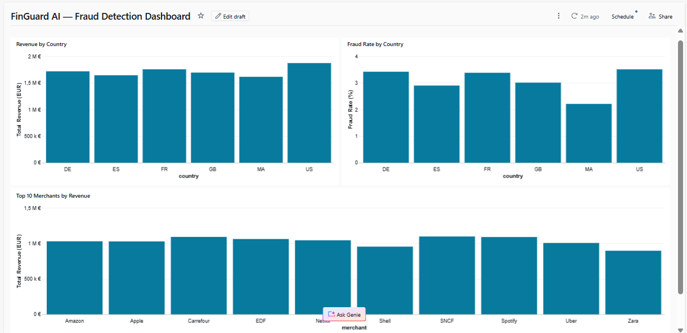

# 🏦 FinGuard AI

### Real-Time FinTech Risk & Fraud Detection Lakehouse Platform


---

## 📌 Description

**FinGuard AI** est une plateforme Data Engineering complète dédiée à la détection de fraude bancaire en temps réel.

Elle simule une architecture utilisée dans les banques et fintechs modernes comme Revolut, BNP Paribas ou Société Générale.

---

## 🏗️ Architecture
Transaction Generator → Kafka → Databricks → Bronze → Silver → Gold → XGBoost → FastAPI → Airflow

```

---

## ⚡ Stack Technologique

| Catégorie | Technologies |
|---|---|
| **Streaming** | Apache Kafka, Zookeeper |
| **Processing** | Apache Spark, Databricks |
| **Storage** | Delta Lake, Architecture Medallion |
| **ML** | XGBoost, Scikit-learn, MLflow |
| **API** | FastAPI, Uvicorn |
| **Orchestration** | Apache Airflow |
| **Infrastructure** | Docker, Docker Compose |

---

## 📊 Résultats

| Métrique | Valeur |
|---|---|
| Transactions traitées | 10 000 |
| Taux de fraude simulé | 3% |
| Fraudes détectées | 323 |
| Précision du modèle | 96% |
| AUC-ROC | 0.9956 |
| F1-Score | 0.9618 |
| Durée pipeline Airflow | 35 secondes |

---

## 📁 Structure du projet
```

finguard-ai/ ├── 01_bronze/ │ └── transaction_generator.py ├── 05_api/ │ ├── main.py │ ├── Dockerfile │ └── requirements.txt ├── 06_airflow/ │ └── dags/ │ └── finguard_pipeline.py ├── 08_docker/ │ └── docker-compose-full.yml └── README.md

```

---

## 🚀 Lancement rapide

```bash
# 1. Cloner le projet
git clone https://github.com/Fatihoussa/finguard-ai.git
cd finguard-ai

# 2. Lancer Kafka + Airflow
cd 08_docker
docker-compose -f docker-compose-full.yml up -d

# 3. Lancer FastAPI
cd 05_api
python -m uvicorn main:app --reload --port 8000

# 4. Lancer le générateur
python 01_bronze/transaction_generator.py
```

---

## 🔌 API Endpoints

### POST /predict-risk
```json
{
  "amount": 9500.00,
  "amount_eur": 8740.00,
  "currency": "USD",
  "country": "US",
  "device": "mobile"
}
```

### Response
```json
{
  "fraud_score": 0.9997,
  "is_fraud": true,
  "risk_level": "HIGH",
  "recommendation": "BLOCK"
}
```

---
## 📈 Dashboard


## 🌐 Interfaces

| Service | URL |
|---|---|
| Kafka UI | http://localhost:8080 |
| Airflow | http://localhost:8081 |
| FastAPI Docs | http://localhost:8000/docs |

---

## 👩‍💻 Auteur

**Fatima Ezzahrae Houssa** — Data Engineering Student

[](https://github.com/Fatihoussa)
```
